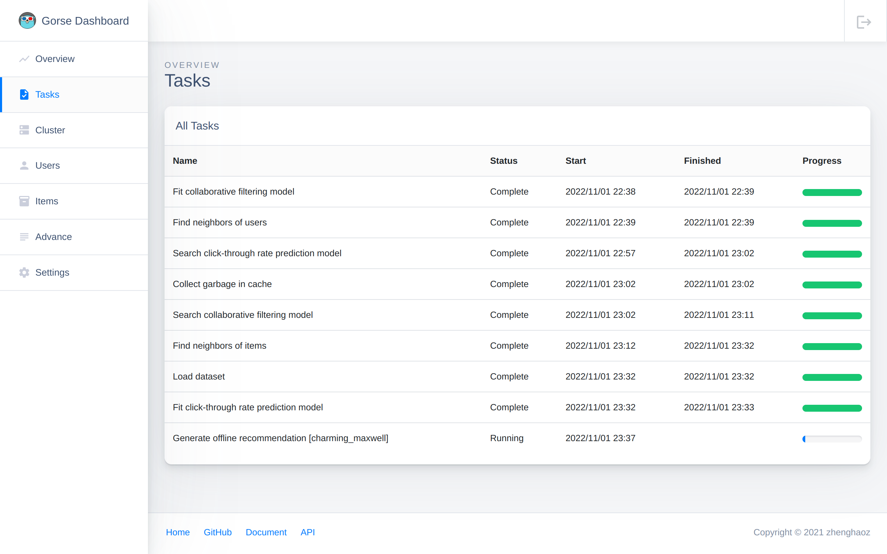

# Quick Start

This guide walks you through the quickest way to setup a recommender system for GitHub repositories based on dataset from [GitRec](https://gitrec.gorse.io/). Make sure you have installed the following softwares at the beginning: 

- [Docker](https://docs.docker.com/get-docker/), nodes will run in containers.
- [Docker Compose](https://docs.docker.com/compose/install/), nodes will be orchestrated by Docker Compose.

## Setup Gorse

Gorse supports to be single node or multiple nodes. This section demonstrates how to setup a minimal usable Gorse single node via playground and a multiple nodes cluster via Docker Compose.

### Option 1: Setup Gorse-in-one node via Playground

Use the following command to setup a Gorse all-in-one node.

::: code-tabs#setup

@tab:active Bash

```bash
curl -fsSL https://gorse.io/playground | bash
```

@tab Docker

```bash
docker run -p 8088:8088 zhenghaoz/gorse-in-one --playground
```

:::

::: tip

For Gorse-in-one, the RESTful endpoint is http://127.0.0.1:8088.

:::

### Option 2: Setup Gorse Cluster via Docker Compose

There is an example [docker-compose.yml](https://github.com/gorse-io/gorse/blob/release-0.4/docker-compose.yml) consists of a master node, a server node and a worker node, a Redis instance, and a MySQL instance.

1. Download [docker-compose.yml](https://github.com/zhenghaoz/gorse/blob/release-0.4/docker-compose.yml) and the config file [config.toml](https://github.com/gorse-io/gorse/blob/release-0.4/config/config.toml).

```bash
# Create a new directory
mkdir gorse
cd gorse

# Download docker-compose.yml and config.tom
wget https://raw.githubusercontent.com/zhenghaoz/gorse/release-0.4/docker-compose.yml
wget https://raw.githubusercontent.com/zhenghaoz/gorse/release-0.4/config.toml
```

2. Setup the Gorse cluster using Docker Compose.

```bash
docker-compose up -d
```

::: details Expected outputs

```
Creating network "gorse_default" with the default driver
Creating gorse_worker_1 ... done
Creating gorse_master_1 ... done
Creating gorse_mysql_1  ... done
Creating gorse_server_1 ... done
Creating gorse_redis_1  ... done
```

:::

3. Download the SQL file [github.sql](https://cdn.gorse.io/example/github.sql) and import to the MySQL instance. This dataset consists of GitHub users, GitHub repositories and interactions between users and repositories.

```bash
# Download sample data.
wget https://cdn.gorse.io/example/github.sql

# Import sample data.
mysql -h 127.0.0.1 -u gorse -pgorse_pass gorse < github.sql
```

There are three kinds of interactions (called "feedbacks" in Gorse) between users and repositories in this dataset.

| Feedback Type | Description |
|-|-|
| star | A user "starred" a repository in GitHub |
| read | A user read a repository in [GitRec](https://gitrec.gorse.io/) |
| like | A user "liked" a repository in [GitRec](https://gitrec.gorse.io/) |

In the configuration file, "read" belongs to `read_feedback_types` while "star" and “like” belong to `positive_feedback_types`.

```toml
# The feedback types for positive events.
positive_feedback_types = ["star","like"]

# The feedback types for read events.
read_feedback_types = ["read"]
```

4. Restart the master node to reload imported data immediately.

```bash
docker-compose restart
```

::: details Expected outputs

```
Restarting gorse_redis_1  ... done
Restarting gorse_mysql_1  ... done
Restarting gorse_master_1 ... done
Restarting gorse_server_1 ... done
Restarting gorse_worker_1 ... done
```

:::

## Get Recommendation

Gorse generate recommendations for users after feedbacks from users are inserted.

Open [http://127.0.0.1:8088](http://127.0.0.1:8088) in browser and the dashboard summarizes all status and data in Gorse.


Wait for all tasks *except "Searching collaborative filtering model" and "Searching click-through prediction model"* completed.



Suppose Bob is a frontend developers who starred several frontend repositories in GitHub. We insert his star feedback to Gorse via the RESTful API.

```bash
read -d '' JSON << EOF
[
    { \"FeedbackType\": \"star\", \"UserId\": \"bob\", \"ItemId\": \"vuejs:vue\", \"Timestamp\": \"2022-02-24\" },
    { \"FeedbackType\": \"star\", \"UserId\": \"bob\", \"ItemId\": \"d3:d3\", \"Timestamp\": \"2022-02-25\" },
    { \"FeedbackType\": \"star\", \"UserId\": \"bob\", \"ItemId\": \"dogfalo:materialize\", \"Timestamp\": \"2022-02-26\" },
    { \"FeedbackType\": \"star\", \"UserId\": \"bob\", \"ItemId\": \"mozilla:pdf.js\", \"Timestamp\": \"2022-02-27\" },
    { \"FeedbackType\": \"star\", \"UserId\": \"bob\", \"ItemId\": \"moment:moment\", \"Timestamp\": \"2022-02-28\" }
]
EOF

curl -X POST http://127.0.0.1:8087/api/feedback \
   -H 'Content-Type: application/json' \
   -d "$JSON"
```

::: details Expected outputs

```json
{
 "RowAffected": 5
}
```

:::

Then, fetch 10 recommended items from Gorse. We can found frontend related repositories are recommended for Bob.

```bash
curl http://127.0.0.1:8087/api/recommend/bob?n=10
```

Expected outputs:

```json
[
    "mbostock:d3",
    "nt1m:material-framework",
    "mdbootstrap:vue-bootstrap-with-material-design",
    "justice47:f2-vue",
    "10clouds:cyclejs-cookie",
    "academicpages:academicpages.github.io",
    "accenture:alexia",
    "addyosmani:tmi",
    "1wheel:d3-starterkit",
    "acdlite:redux-promise"
]
```
