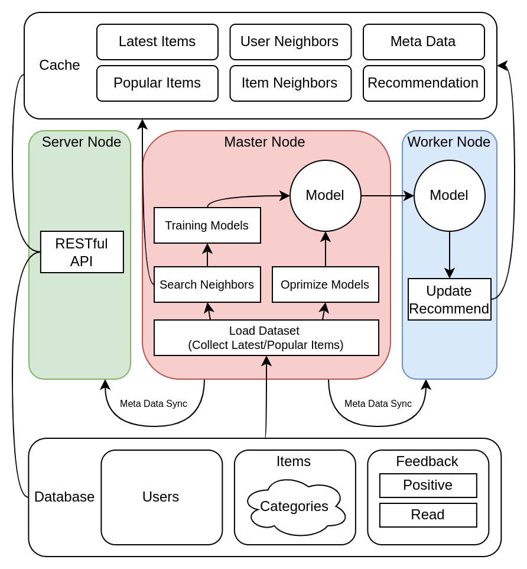

# Monitoring

Recommender systems are complex. The overall workflow in Gorse is as follows:

- **Multi-source Recommendation:** For a user, recommended items are collected from different ways (popular, latest, user-based, item-based, and collaborative filtering) and ranked by click-through rate prediction.
- **AutoML:** Choose the best recommendation model and strategy automatically by model searching in the background.
- **Distributed Recommendation:** Single node training, distributed prediction, and ability to achieve horizontal scaling in the recommendation stage.
- **RESTful API:** Provide RESTful APIs for data CRUD and recommendation requests.
- **Dashboard:** Provide dashboard for data import and export, monitoring, and cluster status checking.

Gorse is a single node training and distributed prediction recommender system. Gorse stores data in MySQL, MongoDB, PostgresSQL, or ClickHouse, with intermediate data cached in Redis.

1. The cluster consists of a master node, multiple worker nodes, and server nodes.
2. The master node is responsible for model training, non-personalized item recommendation, configuration management, and membership management.
3. The server node is responsible for exposing the RESTful APIs and online real-time recommendations.
4. Worker nodes are responsible for offline recommendations for each user.

In addition, the administrator can perform system monitoring, data import and export, and system status checking via the dashboard on the master node.



- Users, items and feedbacks are stored in **database** (a.k.a. `data_store` in config file). [Item Management](/build-recommender/item-management) introduces how to manage items in Gorse. Feedbacks are required to generate personalized recommendations for user, which is discussed in [Feedback Collection](/build-recommender/feedback-collection).
- Latest items, popular items, user neighbors, item neighbors, recommendations and meta data are store in **cache** (a.k.a `cache_store` in config file).
- The **master node** loads data from database. In the process of loading data, popular items and latest items are write to cache. Then, the master node search neighbors and training recommendation models. In background, random search is used to find the optimal recommendation model for current data. The **worker nodes** pull recommendation models from the master node and generate recommendations for each user. The **server nodes** provides RESTful APis. 
    - [Recommendation Strategies](/build-recommender/recommendation-strategies) shows how to define recommendation behaviors. 
    - [Performance vs Precision](/build-recommender/performance-vs-precision) discusses how to trade off between system performance and recommendation precision. 
    - The server nodes and worker nodes synchronize meta information from the master node. The address adn timeout of meta communication are specified in config file.

```toml
[master]

# GRPC port of the master node. The default value is 8086.
port = 8086

# gRPC host of the master node. The default values is "0.0.0.0".
host = "0.0.0.0"

# Number of working jobs in the master node. The default value is 1.
n_jobs = 1

# Meta information timeout. The default value is 10s.
meta_timeout = "10s"
```

All data and status can be viewed in Gorse dashboard (read [Gorse Dashboard](/build-recommender/gorse-dashboard) for more information).
